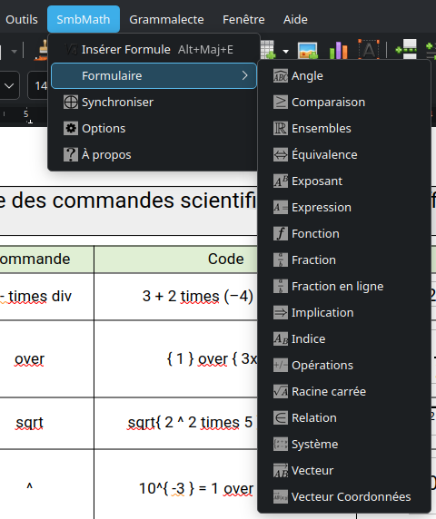

# SmbMath

Extension LibreOffice Writer : outils mathématiques pour l'enseignement secondaire.

**Page de présentation : [obook.github.io/SmbMath](https://obook.github.io/SmbMath/)**

Version actuelle : **2.1**. L'extension fonctionne sous Windows et Linux, avec LibreOffice Writer.

> **Attention** : cette extension est expérimentale, conservez une copie de vos documents avant de l'utiliser. Le créateur ne peut être tenu responsable de la perte de données.

Télécharger LibreOffice : [en français](https://fr.libreoffice.org/download/telecharger-libreoffice/) | [en anglais](https://www.libreoffice.org/download/)

## Fonctionnalités

    

Après installation, un menu **SmbMath** et une barre d'outils sont ajoutés à Writer :

- **Insérer Formule** : transforme le texte sélectionné en formule, ou ouvre l'éditeur de formules si aucun texte n'est sélectionné
- **Formulaire** : insertion rapide de formules prédéfinies, classées par ordre alphabétique (voir ci-dessous)
- **Synchroniser** : applique une police, une taille et des paramètres uniformes à toutes les formules du document
- **Options** : choix du mode d'insertion, texte brut ou objet OLE
- **À propos** : auteur et numéro de version de l'extension

### Formules disponibles

| Formule | Description |
|---------|-------------|
| Angle | Notation d'angle `widehat{ABC}` |
| Comparaison | Inégalités |
| Ensembles | Ensembles de nombres N, Z, D, Q, R, C |
| Équivalence | Double flèche `A <=> B` |
| Exposant | Mise en exposant `A^B` |
| Expression | Expression avec retour à la ligne |
| Fonction | Notation fonction `f:x -> 2x+3` |
| Fraction | Fraction `a/b` |
| Fraction en ligne | Fraction en ligne (taille réduite) |
| Implication | Flèche d'implication `A => B` |
| Indice | Mise en indice `A_B` |
| Opérations | Addition, soustraction, multiplication, division |
| Racine carrée | Racine carrée `sqrt(a)` |
| Relation | Appartenance, non-appartenance, complémentaire |
| Système | Système d'équations |
| Vecteur | Notation vecteur `vec{AB}` |
| Vecteur Coordonnées | Vecteur avec coordonnées |

Chaque formule est insérée en syntaxe StarMath, le langage de l'éditeur de formules de LibreOffice. Après insertion, le curseur est repositionné à l'endroit utile pour compléter la formule.

### Synchronisation

L'outil de synchronisation permet d'uniformiser toutes les formules OLE d'un document :

- Police (par défaut : **CMU Serif**)
- Taille de police (par défaut : 12)
- Taille relative des exposants et indices (par défaut : 65 %)
- Taille relative des limites (par défaut : 65 %)

La police **CMU Serif** (Computer Modern) est recommandée : c'est la police de LaTeX, qui donne aux formules un rendu professionnel. Elle peut être téléchargée sur [checkmyworking.com](https://www.checkmyworking.com/cm-web-fonts/).

## Installation

1. Télécharger la dernière version : [smbmath.oxt](https://github.com/obook/SmbMath/raw/main/smbmath.oxt)
2. Dans LibreOffice Writer, menu **Outils > Gestionnaire des extensions**
3. Cliquer sur **Ajouter** et sélectionner le fichier `smbmath.oxt`
4. Accepter la licence, puis redémarrer LibreOffice

L'extension vérifie ensuite automatiquement les mises à jour publiées sur ce dépôt (menu **Outils > Gestionnaire des extensions > Vérifier les mises à jour**).

## Construire l'extension depuis les sources

Le paquet `.oxt` est une simple archive ZIP du dossier `src/` :

- Linux : `./make_extension.sh`
- Windows : `make_extension.bat`

Le code est écrit en StarBasic (macros LibreOffice), dans deux modules : `src/SmbMath/MainModule.xba` (insertion des formules, options) et `src/SmbMath/SyncModule.xba` (synchronisation des formules OLE). Pour publier une nouvelle version, mettre à jour le numéro dans `src/description.xml` et `src/smbmath.update.xml` (voir `VERSION.md`), puis reconstruire le paquet.

## Historique des versions

Voir [RELEASE.md](./RELEASE.md).

## Licence

Logiciel gratuit pour un usage non commercial, l'utilisation dans un cadre éducatif étant expressément encouragée. L'entraînement de modèles d'intelligence artificielle sur ce code est interdit. Texte complet : [Licence SmbMath](./LICENSE.md).
